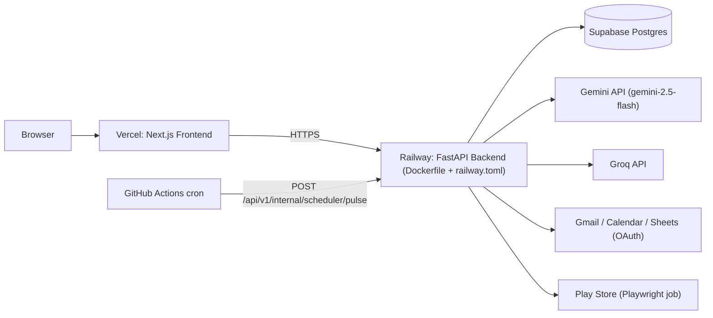
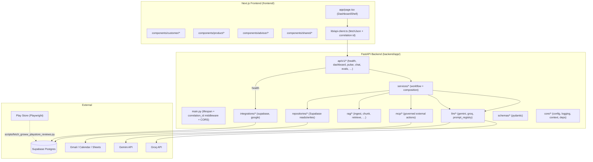
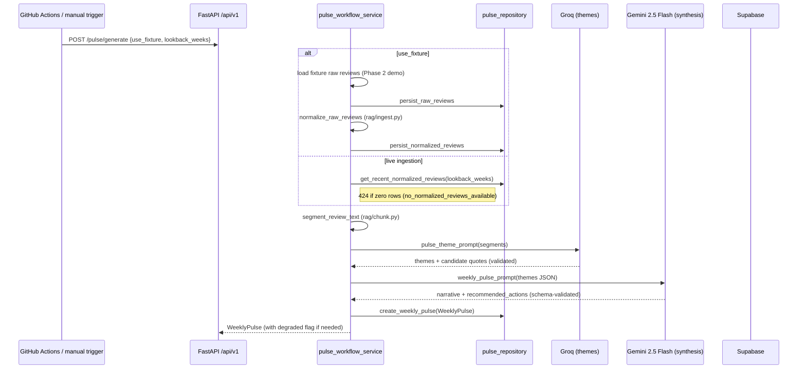
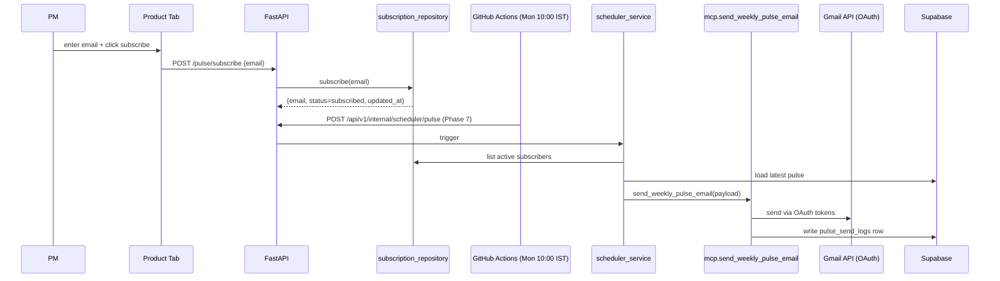
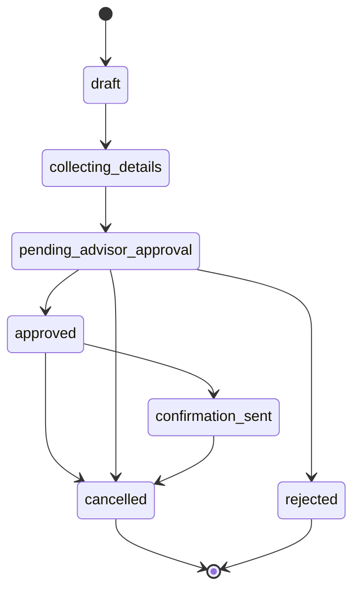
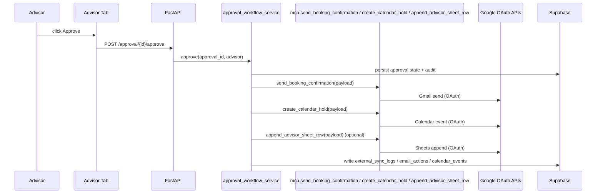

# Low Level Architecture — Groww Product Operations Ecosystem

This document is the **component-level companion to [Docs/Architecture.md](Architecture.md)**. It defines exactly **how** each part of the system is structured today (frontend module → API route → service → repository → DB / external API), grounded in the current repo. The **product behavior contract** comes from [Docs/UserFlow.md](UserFlow.md); UI states from [Docs/UI.md](UI.md); guardrails from [Docs/Rules.md](Rules.md); failure modes from [Docs/Failures&EdgeCases.md](Failures&EdgeCases.md); operational steps from [Docs/Runbook.md](Runbook.md); canonical sources from [Deliverables/Resources.md](../Deliverables/Resources.md).

This file is intentionally **implementation-specific** (tables, endpoints, modules), so it must be updated whenever those artifacts change.

---

## 1. How to use this document

- Treat `Docs/UserFlow.md` as the **product contract** (what should happen for PM, Customer, Advisor).
- Treat `Docs/Architecture.md` as the **system contract** (boundaries, decisions, phase plan).
- Treat **this file** as the **implementation contract** (which router, which service, which repo, which table).
- If two documents disagree, precedence is: `Docs/Architecture.md` → `Docs/Rules.md` → `Docs/UserFlow.md` → this file.

### Conventions

- All API routes are mounted under `/api/v1` by `backend/app/api/v1/__init__.py`.
- All API responses use `APIEnvelope` (`backend/app/schemas/common.py`):

  ```json
  { "success": true, "message": "…", "data": { … }, "errors": [] }
  ```

- All requests/responses carry `X-Correlation-ID` (frontend generates it; backend echoes it). See §6.
- All times shown to users are **Asia/Kolkata (IST)** unless explicitly overridden (`DEFAULT_TIMEZONE` in `.env`).

---

## 2. Deployment topology



Frontend deploys via Vercel (Next.js). Backend deploys via Railway using the **root** `Dockerfile` and `railway.toml` (`uvicorn app.main:app --host 0.0.0.0 --port $PORT`). Persistent state lives in Supabase Postgres (schema in `infra/supabase/phase1_phase2_schema.sql`). External APIs are called only from the backend.

A legacy `backend/render.yaml` file may still exist from prior iterations but is **not** the active deploy config — see Architecture.md for the full “locked decisions”.

---

## 3. High-level component map



Key code anchors:
- Frontend entry: `frontend/app/page.tsx` (loads `/api/v1/health` and `/api/v1/dashboard/badges` in parallel; renders Customer/Product/Advisor tabs).
- Backend entry: `backend/app/main.py` (mounts `api_router` with `/api/v1`, applies CORS + correlation middleware, runs the Supabase startup check).

---

## 4. Frontend module structure

| Concern | Module | Notes |
| --- | --- | --- |
| Shell + tab switching | `frontend/components/dashboard/DashboardShell.tsx` (driven from `app/page.tsx`) | Hosts `RoleTabs`, `ActionBadge`, `StatusBanner` per Architecture.md (§Frontend architecture). |
| Customer tab | `frontend/components/customer/*` (`CustomerTab`, `ChatPanel`, `PromptChips`, `BookingCard`, `ChatHistory`, `VoiceControls`) | Phase 3 wires `ChatPanel` + `PromptChips` to `/api/v1/chat/*`. Phase 5+ adds booking. |
| Product tab | `frontend/components/product/*` (`ProductTab`, `PulseCard`, `SubscribePanel`, `IssueAnalytics`, `SendStatusCard`) | Calls `/api/v1/pulse/*`. Email send (`/api/v1/pulse/send-now`) lights up in Phase 7. |
| Advisor tab | `frontend/components/advisor/*` (`AdvisorTab`, `PendingApprovalsTable`, `BookingSummaryDrawer`, `UpcomingSlots`, `ApprovalActions`) | Wired in Phase 6. |
| Shared UI states | `frontend/components/shared/*` (`LoadingState`, `ErrorState`, `InlineStatus`) | Implements `Docs/Rules.md` UI1–UI17 (loading/empty/error/partial states). |
| HTTP client | `frontend/lib/api-client.ts` | Reads `NEXT_PUBLIC_API_BASE_URL`, generates `X-Correlation-ID` per request, returns `ApiEnvelope<T>`. |
| Badge config | `frontend/lib/badge-config.ts` | Static UI mapping for badge keys to label/description. Backend remains the source of truth for values. |
| Constants/formatters | `frontend/lib/constants.ts`, `frontend/lib/formatters.ts` | Tab IDs, IST formatting helpers. |

The **frontend never** computes badge counts or workflow truth on its own (Architecture.md §Badge architecture).

---

## 5. Backend module structure

```
backend/app/
├── main.py                       # FastAPI app, lifespan, CORS, correlation middleware
├── core/
│   ├── config.py                 # Pydantic Settings (env vars + cors_origins() + safe_public_dict)
│   ├── context.py                # ContextVar correlation_id
│   ├── dependencies.py           # CorrelationIdDep, etc.
│   ├── logging.py                # configure_logging(); CorrelationFilter; "cid=…" formatter
│   └── security.py               # token-encryption helpers (Phase 7+)
├── api/
│   ├── router.py                 # re-exports api_router
│   └── v1/
│       ├── __init__.py           # builds api_router with /api/v1 prefix
│       ├── health.py             # GET  /api/v1/health
│       ├── dashboard.py          # GET  /api/v1/dashboard/badges
│       ├── pulse.py              # POST /api/v1/pulse/generate, current/history/subscribe/unsubscribe
│       ├── chat.py               # POST /api/v1/chat/message, /prompts, /history/{session_id}
│       ├── evals.py              # POST /api/v1/evals/run (suite=phase1|phase2|phase3)
│       ├── booking.py            # (Phase 5; placeholder)
│       ├── advisor.py            # (Phase 6; placeholder)
│       ├── approval.py           # (Phase 6; placeholder)
│       ├── auth.py               # (Phase 7; Google OAuth)
│       ├── voice.py              # (Phase 8; STT/TTS adapter)
│       └── internal.py           # (Phase 7; scheduler webhook)
├── schemas/                      # Pydantic request/response models (typed boundaries; Rules D1)
│   ├── common.py                 # APIEnvelope[T], ErrorDetail
│   ├── pulse.py                  # RawReview, NormalizedReview, PulseTheme/Quote/Metrics, WeeklyPulse
│   ├── chat.py                   # ChatMessage, ChatMessageRequest/Result, PromptChip
│   ├── dashboard.py              # CustomerBadges, ProductBadges, AdvisorBadges, BadgePayload
│   ├── booking.py / approval.py / advisor.py / auth.py   # (Phase 5–7; placeholders)
├── services/                     # workflow/composition logic
│   ├── badge_service.py          # compute_badges(): pulls supabase health + counts
│   ├── pulse_workflow_service.py # canonical pulse pipeline (§7)
│   ├── customer_router_service.py# Phase 3 deterministic intent skeleton
│   ├── prompt_service.py         # Phase 3 prompt chips
│   ├── booking_workflow_service.py / approval_workflow_service.py / advisor_context_service.py / scheduler_service.py / google_oauth_service.py    # (later phases)
├── repositories/                 # DB persistence isolation
│   ├── pulse_repository.py
│   ├── chat_repository.py
│   ├── subscription_repository.py
│   └── booking/approval/analytics/token/log_repository.py    # (later phases)
├── rag/                          # ingestion + retrieval
│   ├── ingest.py                 # normalize_raw_reviews(); Phase 4 will add MF/fee ingestion
│   ├── chunk.py                  # segment_review_text(); Phase 4 will add MF/fee chunking
│   └── bm25.py / embeddings.py / fusion.py / rerank.py / retrieve.py / answer.py     # (Phase 4)
├── llm/
│   ├── gemini_client.py          # Gemini 2.5 Flash wrapper (primary + fallback keys)
│   ├── groq_client.py            # Groq wrapper (primary + fallback keys)
│   ├── prompt_registry.py        # pulse_theme_prompt(), weekly_pulse_prompt(), …
│   └── task_router.py / cache.py # (Phase 4+)
├── mcp/                          # governed external actions (Phase 7)
├── integrations/
│   ├── supabase/client.py        # check_supabase_connectivity(); typed CRUD helpers
│   └── google/                   # gmail/calendar/sheets/stt/tts (Phase 7–8)
├── db/                           # base/session/migrations metadata (Supabase managed)
└── evals/
    ├── run_all.py                # CLI; supports --phase 1|2|3
    ├── phase1_checks.py          # connectivity + health + badges + correlation id
    ├── pulse_checks.py           # phase 2 pulse APIs + pipeline shape
    └── phase3_checks.py          # phase 3 chat endpoints + roundtrip
```

Empty placeholder files (e.g. `schemas/booking.py`, `models/*.py`) intentionally exist to **lock the project structure** per `Docs/Rules.md` G16 / P1.5; do not delete them when later phases plug content in.

---

## 6. Cross-cutting concerns

### 6.1 Correlation IDs

- **Frontend** generates a per-request `X-Correlation-ID` (see `frontend/lib/api-client.ts`).
- **Backend** middleware (`backend/app/main.py`) reads `X-Correlation-ID` (case-insensitive), generates one if missing (UUID4, capped at 128 chars), echoes it on the response, and stores it in a `ContextVar` (`backend/app/core/context.py`).
- **Logging** (`backend/app/core/logging.py`) prepends `cid=<correlation_id>` to every log line via `CorrelationFilter`.
- **Health endpoint** (`/api/v1/health`) includes the resolved `correlation_id` in `data.correlation_id`.

### 6.2 Standard API envelope

All routes return `APIEnvelope[T]` (`backend/app/schemas/common.py`):

```json
{
  "success": true,
  "message": "health",
  "data": { "...": "..." },
  "errors": []
}
```

Response models are explicit (e.g. `response_model=APIEnvelope[BadgePayload]`) to enforce schema validation at the boundary (Rules D1, C4).

### 6.3 Config and secrets

- Single source: `backend/app/core/config.py` (`Settings`).
- Required at startup (`@model_validator`): `APP_ENV`, `FRONTEND_BASE_URL`, `SUPABASE_URL`, `SUPABASE_SERVICE_ROLE_KEY`.
- `safe_public_dict()` is the **only** sanctioned way to render config in logs / health payloads (Rules P1.4, O5). It never returns secret values.
- LLM keys (`GEMINI_API_KEY`, `GEMINI_API_KEY_FALLBACK`, `GROQ_API_KEY`, `GROQ_API_KEY_FALLBACK`) and Google OAuth secrets are backend-only.
- See [Docs/Runbook.md](Runbook.md) **Required env groups** for the canonical env list aligned with `.env.example`.

### 6.4 CORS

- `_setup_cors(app)` in `backend/app/main.py` reads `Settings.cors_origins()` (comma-separated `FRONTEND_BASE_URL` values).
- Wildcard origins are forbidden when credentials are involved (Rules + Architecture §Env rules).

---

## 7. Customer surface (UserFlow.md → implementation)

### 7.1 Product behavior (from UserFlow.md)

The customer can use **typed input**, **prompt chips**, and **voice** in the same session. The assistant supports MF questions, fee explainer questions, hybrid questions, booking, and cancellation by booking ID. Hybrid prompts must be answered fully. After booking, the customer receives a copyable booking ID. The customer’s confirmation email is gated on advisor approval.

### 7.2 Frontend → backend wiring

```mermaid
sequenceDiagram
  participant U as Customer (browser)
  participant FE as Customer Tab
  participant API as FastAPI /api/v1
  participant SVC as customer_router_service
  participant REPO as chat_repository
  participant DB as Supabase

  U->>FE: type message OR click prompt chip
  FE->>API: POST /chat/message {session_id?, message}
  API->>REPO: create_session if needed
  API->>REPO: add_message(role=user)
  API->>SVC: generate_customer_response(session_id, message)
  SVC-->>API: assistant text (Phase 3 deterministic; Phase 4 RAG)
  API->>REPO: add_message(role=assistant)
  API-->>FE: ApiEnvelope<ChatMessageResult>
  FE->>API: GET /chat/history/{session_id}
  API->>REPO: get_history(session_id)
  REPO-->>API: list[ChatMessage]
  API-->>FE: ApiEnvelope<list[ChatMessage]>
```

### 7.3 Endpoint contracts

- `POST /api/v1/chat/message` — body `ChatMessageRequest { session_id?, message (1..2000) }`; returns `ApiEnvelope<ChatMessageResult { session_id, assistant_message, created_at }>`.
- `GET /api/v1/chat/history/{session_id}` — returns `ApiEnvelope<list[ChatMessage]>` (each `{ id, session_id, role, content, created_at }`).
- `GET /api/v1/chat/prompts` — returns `ApiEnvelope<list[PromptChip { id, label, prompt }]>`.

### 7.4 Phase status

- **Phase 3 (current):** Deterministic intent skeleton in `customer_router_service.generate_customer_response` (no RAG, no fabricated citations). Prompt chips via `prompt_service.get_prompt_chips`. Roundtrip persistence is required (see `phase3_checks.py`).
- **Phase 4 (next):** Replaces the deterministic skeleton with the RAG engine (BM25 + embeddings → fusion → optional rerank → grounded answer) and citation-bearing responses, per Architecture.md §RAG / knowledge architecture and `Docs/Rules.md` P4.x. Hybrid (MF + fee) must be answered in one response.
- **Phase 5–7:** Adds booking UX, cancel-by-ID, and approval-gated confirmation email.

### 7.5 Failure handling

See [Docs/Failures&EdgeCases.md](Failures&EdgeCases.md) Phase 3/4 sections. Key invariants the implementation must keep:
- Prompt chips share the same validated runtime path as typed input (Rules P3.2).
- Weak retrieval must lead to safe fallback (Rules P4.3).
- Customer responses remain product-safe — no unsupported financial advice (Rules R6 / P4.5).

---

## 8. Product (PM) surface (UserFlow.md → implementation)

### 8.1 Product behavior (from UserFlow.md)

A PM opens the dashboard, can subscribe to the weekly pulse email, and sees the same pulse on the dashboard. After subscribing, they receive the current pulse and then weekly pulses every Monday 10:00 IST. The dashboard shows clear feedback when subscription/sends change. Issue analytics derive from chat/booking context, **not** from Google Sheets. The structured fee explainer pattern is **not** allowed on the Product tab or in the weekly pulse email body.

### 8.2 Pulse generation pipeline (canonical order in Resources.md)

The canonical short pipeline order lives in [Deliverables/Resources.md](../Deliverables/Resources.md) (**Weekly Pulse from Play Store (order)**). Implementation lives in `backend/app/services/pulse_workflow_service.py` and is enforced by `phase2` evals.



Pipeline-stage logs use the structured event names already present in the service (`pipeline_stage raw_persisted`, `pipeline_stage normalized_persisted`, `pipeline_stage themes_generated`, `pipeline_stage pulse_persisted`).

### 8.3 Endpoint contracts

| Method | Path | Body | Response |
| --- | --- | --- | --- |
| `POST` | `/api/v1/pulse/generate` | `PulseGenerateRequest { lookback_weeks: 1..8, use_fixture: bool }` | `ApiEnvelope<WeeklyPulse>` |
| `GET` | `/api/v1/pulse/current` | — | `ApiEnvelope<WeeklyPulse | null>` |
| `GET` | `/api/v1/pulse/history?limit=N` | — | `ApiEnvelope<list[WeeklyPulse]>` |
| `POST` | `/api/v1/pulse/subscribe` | `SubscribeRequest { email }` | `ApiEnvelope<SubscribeResult>` |
| `POST` | `/api/v1/pulse/unsubscribe` | `SubscribeRequest { email }` | `ApiEnvelope<SubscribeResult>` |
| `POST` | `/api/v1/pulse/send-now` (Phase 7) | scheduled via internal scheduler | `ApiEnvelope<…>` |

`WeeklyPulse` (`backend/app/schemas/pulse.py`) carries `pulse_id`, `metrics { reviews_considered, average_rating, lookback_weeks }`, `themes`, `quotes`, `recommended_actions`, `narrative`, plus `degraded` + `degraded_reason` for honest UI states (`Docs/Rules.md` UI4 + Phase 2 failure rows in `Failures&EdgeCases.md`).

### 8.4 Subscription + scheduled send



### 8.5 Product analytics

Per UserFlow.md, the PM area must surface analytics on **why** customers book advisor sessions, derived from chat/booking context (not Google Sheets). The current implementation does not yet ship those queries; they will live under `repositories/analytics_repository.py` and be exposed by the Product tab (Architecture.md §Product analytics, Phase 5–6).

### 8.6 Fee-explainer scope (must hold across implementation)

- `Docs/UI.md` and `Docs/UserFlow.md` require: no customer-style six-bullet fee explainer on the Product tab or in weekly pulse email.
- The implementation must **never** render that pattern from `ProductTab.tsx` or include it in `mcp/send_weekly_pulse_email`. It is a Customer/Advisor-surface-only construct (`Docs/Rules.md` UI18).

---

## 9. Advisor surface (UserFlow.md → implementation)

### 9.1 Product behavior (from UserFlow.md)

The advisor approves or rejects bookings; the customer receives the booking confirmation email **only after** approval. The advisor sees pending and upcoming items, each with a booking ID, a chat summary, and (where surfaced) a proposed confirmation email and conversation summary.

### 9.2 Approval workflow



State labels match Architecture.md §Booking architecture and must be defined in a single enum module (Rules D3) before the Phase 5/6 routers go live.

### 9.3 Endpoint contracts (Phase 5–6 plan)

| Method | Path | Purpose |
| --- | --- | --- |
| `POST` | `/api/v1/booking/create` | start a booking from the customer flow |
| `POST` | `/api/v1/booking/cancel` | cancel by `booking_id` |
| `GET` | `/api/v1/booking/{booking_id}` | fetch booking detail |
| `GET` | `/api/v1/advisor/pending` | pending approvals for advisor tab |
| `GET` | `/api/v1/advisor/upcoming` | upcoming approved sessions |
| `POST` | `/api/v1/approval/{approval_id}/approve` | idempotent advisor approval |
| `POST` | `/api/v1/approval/{approval_id}/reject` | idempotent advisor rejection |

Idempotency keys (Rules G9, P6.3) must be enforced server-side; the customer/advisor views must reconcile from a single source of truth (Rules W2, Failure: “Customer and advisor tabs disagree”).

### 9.4 Approval → Gmail/Calendar/Sheets (Phase 7)



Sheets is **never** the source of truth (Architecture.md §Architectural principles 3, Rules I/D). All side effects must be approval-gated (Rules I3, P6.6).

---

## 10. Data layer

### 10.1 Implemented today (`infra/supabase/phase1_phase2_schema.sql`)

| Table | Purpose | Notable columns |
| --- | --- | --- |
| `app_users` | reserved for future user records | `user_id`, `email`, `created_at` |
| `app_sessions` | session metadata | `session_id`, `user_id?`, `last_seen_at`, `metadata jsonb` |
| `audit_logs` | structured audit | `correlation_id`, `actor`, `event_type`, `entity_type`, `entity_id`, `detail jsonb` |
| `review_uploads` | per-batch ingestion record | `upload_id`, `source`, `raw_count`, `normalized_count`, `status` |
| `reviews_raw` | raw Playwright payloads (no PII) | `review_id`, `rating 1..5`, `text`, `review_date`, `device`, `collected_at` |
| `reviews_normalized` | cleaned + normalized rows used by LLM steps | `review_id` (PK), `content_hash`, `normalized_at`, `device` |
| `pulse_runs` | per-pipeline run record | `run_id`, `lookback_weeks`, `degraded`, `degraded_reason`, `metrics jsonb` |
| `weekly_pulses` | persisted pulse rows | `pulse_id`, `metrics`, `themes`, `quotes`, `recommended_actions`, `narrative`, `degraded` |
| `pulse_subscriptions` | subscriber list | `email` (PK), `active`, `updated_at` |
| `pulse_send_logs` | send attempts | `pulse_id?`, `email`, `status`, `provider_message_id`, `error` |

Indexes (selected): `reviews_raw(review_id)`, `reviews_raw(collected_at desc)`, `reviews_normalized(content_hash)`, `weekly_pulses(created_at desc)`, `audit_logs(created_at desc)`, `pulse_subscriptions(active)`.

### 10.2 Planned tables (per Architecture.md §Data architecture)

`google_oauth_tokens`, `chat_sessions`, `chat_messages`, `chat_summaries`, `source_documents`, `document_chunks`, `retrieval_logs`, `bookings`, `booking_slots`, `booking_events`, `booking_cancellations`, `advisor_approvals`, `calendar_events`, `email_actions`, `external_sync_logs`, `booking_issue_analytics`, `tab_badge_state`. Each must be added in an additive migration (Rules D4) and reflected in `infra/supabase/`.

### 10.3 Persistence rules

- Repositories are the **only** path to Supabase (Architecture.md §Repository layer).
- All write paths must persist enough state for **idempotent retries** (Rules G9, W7).
- Raw and normalized review storage is required for replay (Rules D9).
- No PII fields in reviews (no reviewer names, phone, Aadhaar) — see Resources.md.

---

## 11. Pulse pipeline (low-level)

### 11.1 Stages

1. **Collect raw** — `scripts/fetch_groww_playstore_reviews.py` (Playwright, ≤200 reviews per batch per Phase 2 plan in Architecture.md).
2. **Persist raw** — `pulse_repository.persist_raw_reviews([RawReview])` → `reviews_raw`.
3. **Cleaning + normalization** — `rag/ingest.py::normalize_raw_reviews` performs HTML/whitespace cleanup, language/length filters, dedupe via `content_hash`, schema mapping to `NormalizedReview`.
4. **Persist normalized** — `pulse_repository.persist_normalized_reviews([NormalizedReview])` → `reviews_normalized` (PK `review_id`).
5. **Optional segmentation** — `rag/chunk.py::segment_review_text(text, max_chars=800)` for very long entries before theme LLM.
6. **Theme generation (Groq)** — `llm/groq_client.GroqClient.chat_json` with `prompt_registry.pulse_theme_prompt`. Schema-validated to `list[PulseTheme] + list[PulseQuote]`.
7. **Pulse synthesis (Gemini 2.5 Flash)** — `llm/gemini_client.GeminiClient.generate_text` with `prompt_registry.weekly_pulse_prompt`. JSON output parsed and validated; missing/empty narrative is degraded.
8. **Persist + render** — `pulse_repository.create_weekly_pulse(WeeklyPulse)` → `weekly_pulses`; `/api/v1/pulse/current` and `/api/v1/pulse/history` read from there.

### 11.2 Degraded modes

- `groq_key_missing_or_no_reviews` and `groq_degraded:<exc>` fall back to `_rule_based_themes` in `pulse_workflow_service.py`.
- `gemini_key_missing_or_no_reviews` and `gemini_degraded:<exc>` fall back to a deterministic narrative + actions block.
- All degraded outputs persist with `degraded=true` + a structured `degraded_reason`. UI must surface this honestly (Rules UI4, UI14).

### 11.3 LLM key resilience

Per Rules R10 and Architecture.md §API keys, quotas, and fallbacks: `GEMINI_API_KEY` / `GEMINI_API_KEY_FALLBACK` and `GROQ_API_KEY` / `GROQ_API_KEY_FALLBACK` must be wired so the runtime retries once with the fallback key on quota / rate-limit / token-exhaustion errors before surfacing user-visible failure. Logs record `tier=primary|fallback` and `provider=groq|gemini`, never key values.

---

## 12. Customer chat + RAG (Phase 3 → Phase 4)

### 12.1 Phase 3 (live)

- `services/customer_router_service.generate_customer_response` returns a deterministic, bounded response based on lightweight keyword routing (`fee/expense`, `mutual fund/sip`, `book/advisor/appointment`, default educational reply). All responses include the disclaimer “General information only, not financial advice.”
- `repositories/chat_repository` persists `chat_sessions` and `chat_messages` (tables to be added when Phase 4 lands; current impl uses an in-memory or stub repo — keep this in sync with the SQL when wiring real persistence).
- `phase3_checks.py` validates the contract: `/openapi.json` lists chat paths, prompt chips have `{id,label,prompt}`, and a posted message round-trips into `/history/{session_id}`.

### 12.2 Phase 4 (next)

- Replace deterministic skeleton with the RAG path:
  1. Intent classification (Rules R13: refuse early on disallowed intents).
  2. Hybrid retrieval: BM25 (`rag/bm25.py`) + embeddings (`rag/embeddings.py`) → fusion (`rag/fusion.py`) → optional rerank (`rag/rerank.py`).
  3. Grounded answer composition (`rag/answer.py`) using only approved context (Rules R1–R3).
  4. Citation metadata (`source_url`, `last_checked`, `doc_type`) preserved end-to-end (Rules R12 / P4.7).
- MF and fee corpus comes from the URLs in [Deliverables/Resources.md](../Deliverables/Resources.md) §Mutual fund pages and §Fee explainer corpus.
- Hybrid prompts (MF + fee) are answered in one structured response (Rules P4.4).

### 12.3 Voice (Phase 8) — adapter only

`services/voice/*` (later) receives audio, calls `integrations/google/stt_client`, sends the transcript through the **same** `/api/v1/chat/message` runtime, then routes the assistant text through `tts_client` for playback. No business logic is allowed in voice modules (Rules G4 / P8.x).

---

## 13. Eval harness (low-level)

### 13.1 Today

- CLI: `cd backend; python -m app.evals.run_all --phase {1|2|3}`.
- Entrypoint: `backend/app/evals/run_all.py`. Sets stable env defaults (`APP_ENV=eval`, etc.), patches Supabase connectivity, and persists results to `Deliverables/Evals/phase-<n>/eval_<ts>_<version>.json` plus `latest.json`.
- Threshold: **score ≥ 85%** to pass.
- API: `POST /api/v1/evals/run { suite: "phase1"|"phase2"|"phase3" }` exposes the same harness.

### 13.2 Per-phase artifacts

- `Deliverables/Evals/phase-1/README.md` and `phase-2/README.md` document automated runs.
- `Deliverables/Evals/phase-3/README.md` documents the automated chat checks.
- `Deliverables/Evals/phase-4/README.md` … `phase-7/README.md` document **manual acceptance gates** until automated harnesses are added.

### 13.3 Future automation

When Phase 4–7 evals automate, add `phase{N}_checks.py` modules and extend `run_all.py` with new phase branches. Architecture.md §Mandatory phase quality gate is the precedence document for the eval gate.

---

## 14. Phase-by-phase implementation plan (low-level)

This section defines, per phase, the **concrete artifacts** (files, endpoints, tables), the **UI states** the surface must support, the **failure scenarios** the implementation must cover, the **operational checks** to validate, and the **acceptance / Definition of Done**. It is the implementation contract that pairs with the conceptual phase plan in [Docs/Architecture.md](Architecture.md) and the guardrails in [Docs/Rules.md](Rules.md).

Each phase below uses the same fixed template. Cross-references point to single sources of truth so the description does not duplicate them.

### 14.1 Phase 1 — Project skeleton, config, health, badges

- **Goal:** dashboard shell, FastAPI skeleton, health endpoint, dashboard badges, Supabase connectivity baseline, local CORS validated. Source: [Docs/Rules.md](Rules.md) Phase 1 P1.1–P1.7 + Definition of Done; [Docs/Architecture.md](Architecture.md) Phase 1.
- **Backend artifacts:**
  - `backend/app/main.py` — FastAPI lifespan + correlation_id middleware + CORS allowlist from `FRONTEND_BASE_URL` (Rules P1.7).
  - `backend/app/core/config.py` — `Settings` validator that fails fast on missing `APP_ENV` / `FRONTEND_BASE_URL` / `SUPABASE_URL` / `SUPABASE_SERVICE_ROLE_KEY` (Rules P1.1, P1.4); `safe_public_dict()` is the only sanctioned config snapshot.
  - `backend/app/core/logging.py` + `backend/app/core/context.py` — structured logs with `cid=<correlation_id>` (Rules O1, O5).
  - `backend/app/api/v1/health.py` — `GET /api/v1/health` returns `status` (`ok` or `degraded`), correlation id, supabase reachability flag, and `safe_public_dict()`.
  - `backend/app/api/v1/dashboard.py` — `GET /api/v1/dashboard/badges` (Rules P1.6).
  - `backend/app/services/badge_service.py` — backend-owned badge computation; frontend never derives counts (Rules P1.6 + Architecture.md §Badge architecture).
  - `backend/app/integrations/supabase/client.py` — `check_supabase_connectivity` used at startup (skippable in dev via `PHASE1_SKIP_SUPABASE_STARTUP_CHECK=true`).
  - `backend/app/evals/phase1_checks.py` + `backend/app/evals/run_all.py` — automated Phase 1 evals.
- **Frontend artifacts:**
  - `frontend/app/page.tsx` — DashboardShell, parallel calls to `/api/v1/health` and `/api/v1/dashboard/badges`, partial-success handling.
  - `frontend/lib/api-client.ts` — generates `X-Correlation-ID` per request, returns `ApiEnvelope<T>`.
  - `frontend/lib/badge-config.ts` — UI label/description map only (values stay backend-owned).
  - `frontend/components/shared/{LoadingState,ErrorState,InlineStatus}.tsx` — reusable UI states (Rules UI15).
- **Data/schema:** `app_users`, `app_sessions`, `audit_logs` already in [infra/supabase/phase1_phase2_schema.sql](../infra/supabase/phase1_phase2_schema.sql).
- **UI states required:**
  - All three tabs render basic shells; status banners show health, correlation id, and Supabase reachability. Source: [Docs/UI.md](UI.md) §Information architecture.
  - Loading / empty / error / partial / ideal must all be supported on the dashboard strip; do not rely on color alone (Rules UI1, UI2, UI4, UI5, UI8).
  - Layout must remain usable on common laptop and tablet widths from day one (Rules UI11).
- **Targeted failure scenarios** (from [Docs/Failures&EdgeCases.md](Failures&EdgeCases.md) Phase 1):
  - Missing required env var → fail fast at startup with clear message (do not partially boot).
  - Frontend points to wrong backend (`NEXT_PUBLIC_API_BASE_URL`) → visible connectivity error, not silent.
  - CORS mismatch on `localhost:3000` → `localhost:8000` → developer-visible logs.
  - Secrets accidentally logged → enforced by `safe_public_dict()` only.
  - Backend boots but health degraded → health response distinguishes `ok` vs `degraded`.
- **Operational checks** ([Docs/Runbook.md](Runbook.md)):
  - Local startup sequence; smoke `Invoke-RestMethod http://127.0.0.1:8000/api/v1/health` and `…/dashboard/badges`.
  - Frontend cannot reach backend / Backend fails to boot — incident playbooks.
- **Acceptance / DoD:**
  - Run `cd backend; python -m app.evals.run_all --phase 1` → score ≥ 85%; artifact saved under `Deliverables/Evals/phase-1/`.
  - Frontend boots, backend boots, health endpoint works, badges route works, Supabase connection foundation validated, `.env.example` aligned with implementation (Rules Phase 1 DoD).

### 14.2 Phase 2 — Weekly Pulse backend + Product tab

- **Goal:** end-to-end weekly pulse pipeline (raw → cleaning → normalization → optional segmentation → theme (Groq) → pulse (Gemini 2.5 Flash) → persist → render); Product tab renders current pulse + history + subscription. Pipeline order anchored to [Deliverables/Resources.md](../Deliverables/Resources.md) (**Weekly Pulse from Play Store (order)**).
- **Backend artifacts:**
  - `backend/app/api/v1/pulse.py` — `POST /pulse/generate`, `GET /pulse/current`, `GET /pulse/history`, `POST /pulse/{subscribe,unsubscribe}`.
  - `backend/app/services/pulse_workflow_service.py` — canonical pipeline implementation with structured `pipeline_stage *` logs.
  - `backend/app/repositories/pulse_repository.py` and `backend/app/repositories/subscription_repository.py`.
  - `backend/app/rag/ingest.py` (`normalize_raw_reviews`) and `backend/app/rag/chunk.py` (`segment_review_text`).
  - `backend/app/llm/{groq_client,gemini_client,prompt_registry}.py` — Groq for theme extraction, Gemini for synthesis (Rules R10, primary + fallback keys).
  - `backend/app/evals/pulse_checks.py` — automated Phase 2 evals; CLI: `python -m app.evals.run_all --phase 2`.
- **Scripts:** `scripts/fetch_groww_playstore_reviews.py` (Playwright, ≤200 reviews per batch, Rules P2.6 + Architecture.md Phase 2); `scripts/ingest_sources.py`.
- **Frontend artifacts:** `frontend/components/product/ProductTab.tsx`, `PulseCard.tsx`, `SubscribePanel.tsx`, `IssueAnalytics.tsx`, `SendStatusCard.tsx`.
- **Data/schema:** `review_uploads`, `reviews_raw`, `reviews_normalized`, `pulse_runs`, `weekly_pulses`, `pulse_subscriptions`, `pulse_send_logs` (all in [infra/supabase/phase1_phase2_schema.sql](../infra/supabase/phase1_phase2_schema.sql); review/pulse rows must carry lineage per Rules D9).
- **UI states required:**
  - Product tab handles loading, empty, partial, and error states for pulse + history + subscription (Rules P2.4 + UI1–UI5).
  - State-changing subscribe/unsubscribe actions show pending/success/failure feedback within 200 ms (Rules UI7, L2).
  - **Forbidden:** customer-style six-bullet fee explainer on Product tab or in weekly pulse email (Rules UI18, [Docs/UI.md](UI.md) Product (PM), [Docs/UserFlow.md](UserFlow.md) §Product (PM)).
  - Tables/cards prioritize scanability; classified reviews table supports the device filters (Phone/Chromebook/Tablet) per [Deliverables/Resources.md](../Deliverables/Resources.md).
- **Targeted failure scenarios** (from [Docs/Failures&EdgeCases.md](Failures&EdgeCases.md) Phase 2 + Data collection table):
  - No reviews / empty ingestion → Product tab shows `No pulse available yet` with reason; do not render `done`.
  - LLM returns malformed JSON → schema validation rejects, do not persist corrupt output.
  - Same pulse generated twice → idempotent or version-aware persistence.
  - Playwright selector drift / zero parse count → operator-visible failure, last-good pulse remains.
  - Primary LLM key quota hit → automatic fallback retry once before user-visible failure (Rules R10).
- **Operational checks** ([Docs/Runbook.md](Runbook.md)):
  - *Groww Play Store reviews (Playwright) and RAG corpus* sequence (raw → normalize → optional chunk → pulse).
  - *Manual pulse generation* trigger; *LLM quota or key exhaustion* incident playbook.
- **Acceptance / DoD:**
  - Run `python -m app.evals.run_all --phase 2` → ≥ 85%; artifact under `Deliverables/Evals/phase-2/`.
  - One run demonstrates the canonical pipeline order in Resources.md (or documented degraded mode); subscribe/unsubscribe flow works; Product tab renders current + history.

### 14.3 Phase 3 — Customer text chat foundation

- **Goal:** stable text-only customer chat with prompt chips and persisted session/history; same validated runtime path for chips and typed input. Source: Rules.md Phase 3 P3.1–P3.5; [Docs/UserFlow.md](UserFlow.md) §Customer.
- **Backend artifacts:**
  - `backend/app/api/v1/chat.py` — `POST /chat/message`, `GET /chat/prompts`, `GET /chat/history/{session_id}`.
  - `backend/app/services/customer_router_service.py` — Phase 3 deterministic intent skeleton (no fabricated citations); Phase 4 replaces this with RAG.
  - `backend/app/services/prompt_service.py` — typed `PromptChip { id, label, prompt }` list.
  - `backend/app/repositories/chat_repository.py` — session creation + message persistence.
  - `backend/app/schemas/chat.py` — `ChatMessage`, `ChatMessageRequest`, `ChatMessageResult`, `PromptChip`.
  - `backend/app/evals/phase3_checks.py` — OpenAPI surface check, prompt-chip shape, message roundtrip; CLI `--phase 3`.
- **Frontend artifacts:** `frontend/components/customer/{CustomerTab,ChatPanel,PromptChips,ChatHistory}.tsx`; voice controls remain hidden / disabled until Phase 8.
- **Data/schema:** `chat_sessions`, `chat_messages` (planned, additive migration per Rules D4; reflect in `infra/supabase/`).
- **UI states required:**
  - Empty state on first load with input affordances, never a blank panel (Rules UI2).
  - Inline waiting state shown within 200 ms of submit; first model token target ≤ 2 s (Rules UI3, L2, L5).
  - Prompt chips and typed input go through identical request validation (Rules P3.2).
  - Responses are copyable; `Start new chat` available; chat history persists across reload (`Docs/UI.md` Customer; Rules P3.3).
  - Honest error states with retry guidance (Rules UI4).
- **Targeted failure scenarios** (from [Docs/Failures&EdgeCases.md](Failures&EdgeCases.md) Phase 3):
  - Conversation state resets unexpectedly → reload session if persistence is designed.
  - Prompt suggestion bypasses runtime checks → forbidden; both paths share validation.
  - Empty customer tab on first load → helpful empty state, not a blank panel.
  - Slow first token → visible inline waiting state; do not show fake success.
  - Wrong intent routing → safe fallback; log routing decision with correlation id.
- **Operational checks** ([Docs/Runbook.md](Runbook.md)):
  - End-to-end test (text-only) → Step 3 (Customer text chat).
  - Frontend cannot reach backend → incident playbook.
- **Acceptance / DoD:**
  - Run `python -m app.evals.run_all --phase 3` → ≥ 85%; artifact under `Deliverables/Evals/phase-3/`.
  - Users can submit text + prompt chips; sessions and messages persist; backend routing skeleton present (Rules Phase 3 DoD).

### 14.4 Phase 4 — RAG and grounded hybrid Q&A

- **Goal:** replace the deterministic skeleton with hybrid retrieval (BM25 + embeddings → fusion → optional rerank → grounded answer with citations). Source: Rules.md Phase 4 P4.1–P4.8 + R1–R14.
- **Backend artifacts:**
  - `backend/app/rag/{ingest,chunk,bm25,embeddings,fusion,rerank,retrieve,answer}.py` — full retrieval pipeline.
  - `backend/app/llm/task_router.py`, `backend/app/llm/prompt_registry.py` (extend with MF / fee / hybrid prompts).
  - `backend/app/services/customer_router_service.py` — replace deterministic responses with RAG-backed grounded answers.
  - `scripts/ingest_sources.py` and `scripts/rebuild_index.py` for MF/fee corpus refresh.
  - Future `backend/app/evals/phase4_checks.py` (manual gate today).
- **Frontend artifacts:** `frontend/components/customer/ChatPanel.tsx` renders citation cards; hybrid (MF + fee) responses render in a single, structured turn (Rules P4.4).
- **Data/schema:** `source_documents`, `document_chunks`, `retrieval_logs` (planned; additive). Chunks must retain `source_url`, `last_checked`, `doc_type` end to end (Rules R12 / P4.7).
- **UI states required:**
  - Citations are visible and hyperlinked from approved corpus (Rules R12 + [Docs/UI.md](UI.md) Customer Conversation).
  - Six-bullet fee explainer pattern allowed only on Customer/Advisor surfaces (Rules UI18).
  - Weak-retrieval and refusal cases render bounded, safe fallbacks rather than confident invented answers (Rules R1, R3, R5, P4.3).
  - LLM responses show progress early; target completion under 8 s (Rules L5).
- **Targeted failure scenarios** (from [Docs/Failures&EdgeCases.md](Failures&EdgeCases.md) Phase 4 + Data collection table):
  - No retrieval hit → ask clarifying question or redirect safely (no fabricated answers).
  - Low-quality retrieval → bounded answer; never overstate confidence.
  - Hybrid query → answer both parts grounded, or clarify scope.
  - Scraped HTML / boilerplate in index → block at ingest validation, rebuild after fix.
  - Chunk overlap misconfigured → dedupe and tune; monitor retrieval redundancy.
- **Operational checks** ([Docs/Runbook.md](Runbook.md)):
  - *Groww Play Store reviews (Playwright) and RAG corpus* → step 3 (chunking + index rebuild for MF/fee sources); spot-check retrieved chunk shows no raw HTML and citation metadata is present.
- **Acceptance / DoD (manual gate today):**
  - Record happy paths + at least one weak-retrieval fallback under `Deliverables/Evals/phase-4/`.
  - Hybrid FAQ + fee retrieval works; weak retrieval triggers safe fallback; citations preserved (Rules Phase 4 DoD).

### 14.5 Phase 5 — Booking and customer workflow state

- **Goal:** booking creation from the customer flow, persisted state, cancel by booking ID, safe handling of invalid transitions. Source: Rules.md Phase 5 P5.1–P5.5; [Docs/UserFlow.md](UserFlow.md) §Customer.
- **Backend artifacts:**
  - `backend/app/api/v1/booking.py` — `POST /booking/create`, `POST /booking/cancel`, `GET /booking/{booking_id}`.
  - `backend/app/services/booking_workflow_service.py` — state machine implementation matching the diagram in §9.2.
  - `backend/app/repositories/booking_repository.py`.
  - `backend/app/schemas/booking.py` — single enum module for booking states (Rules D3); booking-id format `BK-YYYYMMDD-NNNN` (Architecture.md §Booking architecture).
  - Future `backend/app/evals/phase5_checks.py` (manual gate today).
- **Frontend artifacts:** `frontend/components/customer/BookingCard.tsx`; copyable booking ID UX (`Docs/UI.md` Customer; [Docs/UserFlow.md](UserFlow.md) Customer).
- **Data/schema:** `bookings`, `booking_slots`, `booking_events`, `booking_cancellations` (planned; additive).
- **UI states required:**
  - Timezone always visible for slots/confirmations (Rules UI13); IST default (`DEFAULT_TIMEZONE=Asia/Kolkata`).
  - Inline form validation for required fields and date sanity (Rules UI9).
  - Destructive cancel actions require confirmation or undo (Rules UI10).
  - Booking states never show fake success — `pending` until backend confirms (Rules UI14).
  - State-changing actions render pending/success/failure (Rules UI7).
- **Targeted failure scenarios** (from [Docs/Failures&EdgeCases.md](Failures&EdgeCases.md) Phase 5):
  - Missing required booking detail → workflow asks only for missing fields.
  - Invalid date / past date → reject with correction guidance.
  - Duplicate booking submission (double-click / retry) → backend prevents duplicates (Rules G9, D6).
  - Cancel for non-existent / already-cancelled booking → idempotent + clear current state.
  - Invalid state transition → blocked with explicit reason (Rules W1).
- **Operational checks** ([Docs/Runbook.md](Runbook.md)):
  - End-to-end test (text-only) → Step 4 (Booking).
- **Acceptance / DoD (manual gate today):**
  - Booking can be initiated, persisted, displayed, cancelled; invalid transitions handled gracefully (Rules Phase 5 DoD); record under `Deliverables/Evals/phase-5/`.

### 14.6 Phase 6 — Advisor operations and HITL approval

- **Goal:** pending approvals visible; advisor approve/reject; cross-tab consistency; idempotent approval; auditable transitions. Source: Rules.md Phase 6 P6.1–P6.6; [Docs/UserFlow.md](UserFlow.md) §Advisor.
- **Backend artifacts:**
  - `backend/app/api/v1/advisor.py` — `GET /advisor/pending`, `GET /advisor/upcoming`.
  - `backend/app/api/v1/approval.py` — `POST /approval/{approval_id}/approve`, `POST /approval/{approval_id}/reject`.
  - `backend/app/services/approval_workflow_service.py` — idempotent transitions with audit (Rules P6.3, P6.5, W4).
  - `backend/app/services/advisor_context_service.py` — advisor summaries from chat/booking context (no raw payload dumps; Rules P6.2).
  - `backend/app/repositories/approval_repository.py`.
  - Future `backend/app/evals/phase6_checks.py` (manual gate today).
- **Frontend artifacts:** `frontend/components/advisor/{AdvisorTab,PendingApprovalsTable,BookingSummaryDrawer,UpcomingSlots,ApprovalActions}.tsx`.
- **Data/schema:** `advisor_approvals` (planned; additive). Audit context lives in `audit_logs`.
- **UI states required:**
  - Cross-tab consistency: Customer and Advisor tabs use the same status vocabulary and badges (Rules UI6, A4, W2).
  - Approve/reject show pending → success/failure visibly (Rules UI7); double-click does not double-trigger (Rules P6.3).
  - Partial-success rendering when one panel succeeds and another fails (Rules UI5).
  - Concise summaries instead of raw payloads (Rules P6.2; [Docs/UI.md](UI.md) Advisor).
- **Targeted failure scenarios** (from [Docs/Failures&EdgeCases.md](Failures&EdgeCases.md) Phase 6):
  - Pending approval missing context → `missing context` state or fallback fetch.
  - Approve clicked twice → idempotent backend.
  - Approve succeeds but UI still pending → state refresh after mutation.
  - Customer/advisor tabs disagree → reconcile from backend source of truth.
  - Concurrent advisor actions → backend enforces single valid terminal transition.
- **Operational checks** ([Docs/Runbook.md](Runbook.md)):
  - End-to-end test (text-only) → Step 5 (Advisor: pending/upcoming + approve/reject).
- **Acceptance / DoD (manual gate today):**
  - Pending approvals visible; approve/reject work; shared state updates consistently; badge counts reflect current state (Rules Phase 6 DoD); record under `Deliverables/Evals/phase-6/`.

### 14.7 Phase 7 — External integrations + scheduler (still locally runnable in dev mode)

- **Goal:** Gmail send, Calendar event creation, optional Sheets append, scheduler webhook for weekly send — all approval-gated, idempotent, and runnable in dev mode without production credentials (Rules I6).
- **Backend artifacts:**
  - `backend/app/api/v1/auth.py` — `GET /auth/google/login`, `GET /auth/google/callback`, `POST /auth/google/refresh`, `POST /auth/google/disconnect` (Architecture.md §Google OAuth architecture).
  - `backend/app/api/v1/internal.py` — `POST /internal/scheduler/pulse` (validated by `SCHEDULER_SHARED_SECRET`).
  - `backend/app/services/google_oauth_service.py`, `backend/app/services/scheduler_service.py`.
  - `backend/app/integrations/google/{gmail_client,calendar_client,sheets_client}.py`.
  - `backend/app/mcp/{send_weekly_pulse_email,send_booking_confirmation,create_calendar_hold,append_advisor_sheet_row,get_latest_pulse_context,get_booking_summary}.py` — each idempotent, small, easy to log (Architecture.md §MCP architecture).
  - `backend/app/core/security.py` — encryption for stored OAuth tokens (Rules D7).
  - Future `backend/app/evals/phase7_checks.py` (manual gate today).
- **Frontend artifacts:** advisor approval triggers governed actions; PM `SendStatusCard` reflects send status; admin `Reconnect Google account` UX surfaces token errors (Rules UI4 + Failures Phase 7).
- **Data/schema:** `google_oauth_tokens` (encrypted refresh token), `email_actions`, `calendar_events`, `external_sync_logs` (planned; additive).
- **Local dev configuration (Rules I6):**
  - Use Google OAuth web-server flow with a localhost callback (e.g. `GOOGLE_REDIRECT_URI=http://localhost:8000/api/v1/auth/google/callback`).
  - `SCHEDULER_SHARED_SECRET` set in `.env`; manually `POST /api/v1/internal/scheduler/pulse` with that secret to simulate the GitHub Actions cron locally (Rules P7.6).
  - MCP actions must have a dev-safe path so end-to-end runs without sending real emails/events when desired (Rules I6).
- **UI states required:**
  - Approval-gated send: never auto-send (Rules I3, P7.3).
  - Visible reconnect / re-auth UX when tokens expire or scopes are missing (Rules UI4 + Failures Phase 7).
  - Long-running send is async / queued; UI shows queued/progress (Rules L6, L13).
- **Targeted failure scenarios** (from [Docs/Failures&EdgeCases.md](Failures&EdgeCases.md) Phase 7):
  - OAuth redirect URI mismatch → actionable setup guidance.
  - Missing or incorrect OAuth scopes → precise scope-missing message.
  - Expired access token → silent refresh; expired/revoked refresh token → `Reconnect Google account`.
  - Email send succeeds but DB status stale → reconcile, do not blindly resend.
  - Calendar event / Sheets append duplicates on retry → idempotency keys (Rules I4, W4).
  - Scheduler triggered twice (cron + manual) → job locking / idempotent run (Rules W7).
  - Secret mismatch on internal scheduler endpoint → 401/403 with safe logs (no leaked secret).
- **Operational checks** ([Docs/Runbook.md](Runbook.md)):
  - End-to-end test (text-only) → Step 6 (Integrations).
  - *Google OAuth fails*, *Gmail/Calendar/Sheets fail*, *Scheduler fails or runs twice* incident playbooks.
- **Acceptance / DoD (manual gate today):**
  - Gmail action works through the backend; Calendar event creation works; Sheets append works if enabled; failures show safe states; scheduler endpoint can be triggered securely (Rules Phase 7 DoD).
  - **Phase 7 acceptance is the explicit local-only gate before voice (Phase 8)** — see §15.

### 14.8 Phase 8 — Voice and final hardening (additive only)

- **Goal:** voice as a thin adapter on top of the existing text runtime; STT/TTS must not contain business logic and must not gate sign-off of Phases 1–7 (Rules G3, G4, P8.0–P8.6).
- **Backend artifacts:**
  - `backend/app/api/v1/voice.py` — `POST /voice/transcribe`, `POST /voice/respond`.
  - `backend/app/integrations/google/{stt_client,tts_client}.py`.
  - Voice path **must** call the same `POST /api/v1/chat/message` runtime; STT output becomes text input, TTS plays back assistant text (Rules P8.1, P8.6).
  - Future `backend/app/evals/phase8_checks.py` covering voice ↔ text parity scenarios (Rules EVAL10).
- **Frontend artifacts:** `frontend/components/customer/VoiceControls.tsx` (push-to-talk, transcript review, cancel/retry).
- **Data/schema:** none new (voice persists the canonical text input after normalization to avoid split histories per Failures Phase 8).
- **UI states required:**
  - Transcript review/correction step before destructive or booking actions (Rules UI10 + Failures Phase 8 “Misheard dates or times”).
  - TTS failure surfaces as audio failure separately while showing the text response (Rules UI4).
  - Microphone-permission denied → recovery steps, not generic failure.
- **Targeted failure scenarios** (from [Docs/Failures&EdgeCases.md](Failures&EdgeCases.md) Phase 8):
  - STT transcript wrong (accents, code-mix) → user-correctable transcript before commit.
  - Empty / very short audio → reject safely; very long audio → cap, segment, or summarize.
  - Voice path triggers different behavior than text → forbidden; route through same orchestration.
  - TTS fails with valid response → still show text.
  - Browser/mobile audio compatibility issue → degrade to text-first.
- **Operational checks** ([Docs/Runbook.md](Runbook.md)):
  - End-to-end test (text-only) must pass through Phase 7 first (see §15).
  - Phase 8 is added only after that.
- **Acceptance / DoD:**
  - Voice input/output works; voice path reuses text runtime; parity scenarios pass; failure handling user-safe (Rules Phase 8 DoD).
  - Record artifacts under `Deliverables/Evals/phase-8/`.

### 14.9 Phase 9 — Deployment (NEW)

- **Goal:** production deployment of the locally-validated Phases 1–7 stack (Phase 8 optional), with hardened env, OAuth callbacks, CORS, scheduler, and incident playbook coverage. This phase introduces no new product behavior; it ports the locally-running app to Vercel + Railway + Supabase.
- **Deployment artifacts:**
  - **Frontend:** Vercel deploy from `frontend/`. Production env vars: `NEXT_PUBLIC_API_BASE_URL` (deployed backend origin), and `NEXT_PUBLIC_SUPABASE_URL`/`NEXT_PUBLIC_SUPABASE_ANON_KEY` only if frontend talks to Supabase directly (Architecture.md §Environment variables).
  - **Backend:** Railway deploy using root `Dockerfile` and `railway.toml`:

    ```toml
    [build]
    dockerfilePath = "Dockerfile"

    [deploy]
    startCommand = "uvicorn app.main:app --host 0.0.0.0 --port $PORT"
    ```

    Set every backend env from [Docs/Runbook.md](Runbook.md) *Required env groups → Backend* in the Railway service.
  - **Database:** Supabase project. Apply [infra/supabase/phase1_phase2_schema.sql](../infra/supabase/phase1_phase2_schema.sql) plus any later additive migrations (Rules D4).
  - **Scheduler:** GitHub Actions workflow under `.github/workflows/weekly-pulse.yml` running on `cron: 30 4 * * MON` (10:00 IST), `POST`-ing to `${BACKEND_URL}/api/v1/internal/scheduler/pulse` with `Authorization: Bearer ${{ secrets.SCHEDULER_SHARED_SECRET }}`.
- **Hardening checklist:**
  - Production CORS allowlist: `FRONTEND_BASE_URL` set to the deployed Vercel origin only (no wildcard with credentials; Architecture.md §Env rules).
  - OAuth callback URI updated in Google Cloud + `GOOGLE_REDIRECT_URI` env to the deployed backend origin.
  - `safe_public_dict()` snapshot still secret-free in production health response (Rules P1.4).
  - Both LLM keys configured (`GEMINI_API_KEY` + `GEMINI_API_KEY_FALLBACK`, `GROQ_API_KEY` + `GROQ_API_KEY_FALLBACK`); fallback tier is observable in logs (`tier=primary|fallback`, `provider=gemini|groq`) — never key values (Rules R10, O5).
  - `SCHEDULER_SHARED_SECRET` rotated for production; GitHub Actions uses repo secret of the same name.
  - `TOKEN_ENCRYPTION_KEY` set; Google refresh tokens stored encrypted (Rules D7).
  - Logs emit start / success / failure events for every critical job (Rules O8).
- **Smoke tests after deploy** ([Docs/Runbook.md](Runbook.md)):
  - Run *Smoke test checklist*: frontend loads, health endpoint OK, all three tabs load, one Customer chat request, one booking path, one advisor approval/rejection, one Product Pulse path, scheduler/manual trigger if affected.
  - Run *Recovery verification* checklist after any rollback.
- **Rollback rules** ([Docs/Runbook.md](Runbook.md)):
  - **Frontend rollback:** Vercel — identify last healthy deployment; roll back; verify dashboard + tabs.
  - **Backend rollback:** Railway — revert to last good commit/config; redeploy; verify `/api/v1/health`, one DB-backed route, one affected integration route.
- **Incident playbook coverage** (must be exercised at least once against production):
  - *Backend fails to boot* (Railway logs + missing env).
  - *Supabase failures* (URL/keys/schema).
  - *LLM quota or key exhaustion* (verify automatic fallback).
  - *Scheduler fails or runs twice* (verify idempotency).
- **Documentation updates required at this phase:**
  - Update [Docs/Runbook.md](Runbook.md) *Production* section if any deploy step changes (Rules G10).
  - Update §2 (Deployment topology) of this file if topology changes (e.g., new region or scheduler).
- **Targeted failure scenarios** (from [Docs/Failures&EdgeCases.md](Failures&EdgeCases.md) Cross-phase):
  - Inconsistent local vs production env behavior → no hardcoded localhost fallbacks in production.
  - Secrets accidentally committed → rotate immediately, remove, update `.env.example` safely.
  - Overly broad OAuth scopes → restrict to only what features need.
  - Retry storm on transient failure → bounded retries + backoff + idempotency.
- **Acceptance / DoD:**
  - Deployed environment passes [Docs/Runbook.md](Runbook.md) *End-to-end test (text-only, before voice)* with no localhost dependencies.
  - At least one production incident playbook (Backend boot OR Supabase failure) verified end-to-end and recorded.
  - Rollback rehearsed once for both frontend and backend (or documented as deferred with explicit acceptance by the maintainer).
  - Record artifacts (URLs, screenshots, logs) under `Deliverables/Evals/phase-9/` (folder to be added).

---

## 15. Local end-to-end readiness (before Phase 8 voice)

This section codifies the **local-first acceptance gate** that must hold before Phase 8 (voice) begins, mirroring [Docs/Runbook.md](Runbook.md) *End-to-end test (text-only, before voice / Phase 8)* and [Docs/Rules.md](Rules.md) G3 / P8.0.

- **Network topology:** all routes work via `localhost:3000` (Next.js) → `localhost:8000` (FastAPI) using the documented CORS allowlist (`FRONTEND_BASE_URL=http://localhost:3000,http://127.0.0.1:3000`).
- **Pulse pipeline:** runs locally end-to-end, either via Playwright fixture (`POST /api/v1/pulse/generate` with `use_fixture=true`) or live ingestion (`scripts/fetch_groww_playstore_reviews.py` → `scripts/ingest_sources.py` → `POST /api/v1/pulse/generate` with `use_fixture=false`). Product tab renders current pulse + history.
- **Customer chat + RAG:** typed input and prompt chips both reach `POST /api/v1/chat/message`; Phase 4 RAG returns grounded MF / fee / hybrid responses with citations (or bounded fallback when retrieval is weak).
- **Booking + advisor approval:** booking can be created and cancelled by ID from the Customer tab; advisor pending/upcoming lists render; approve/reject updates shared state visible to both Customer and Advisor tabs.
- **Phase 7 integrations (dev-safe):** Google OAuth login completes against a localhost callback; Gmail / Calendar / Sheets actions execute through their dev-safe path (Rules I6) without production secrets; scheduler endpoint can be hit manually with `SCHEDULER_SHARED_SECRET` to simulate the weekly cron.
- **Voice is forbidden as a gating dependency.** STT/TTS (Phase 8) must not be required to demonstrate any product workflow; it adds I/O on top of the same backend runtime (Rules G3, G4).

If any of the above cannot be exercised locally, fix Phases 1–7 first; do **not** start Phase 8 or Phase 9 work.

---

## 16. Operational integration points (Runbook anchors)

For deployment, smoke tests, incident response, and rollback procedures, the canonical operational doc is [Docs/Runbook.md](Runbook.md). Quick anchors:

- **Local startup:** `Runbook.md` → *Startup sequence → Local*.
- **Production deploy:** Railway env vars → backend deploy → Vercel env vars → frontend deploy → smoke test.
- **End-to-end test before voice:** `Runbook.md` → *End-to-end test (text-only, before voice / Phase 8)*.
- **Pulse refresh:** `Runbook.md` → *Groww Play Store reviews (Playwright) and RAG corpus*.
- **Incident playbooks:** `Runbook.md` → *Main incident checks* (Playwright/Backend boot/LLM quota/Supabase/Google OAuth/Scheduler).

---

## 17. Compliance with `Docs/Rules.md`

This document, taken together with the implementation, must keep the following invariants visible:

- G2 — boundary respect (frontend vs services vs repos vs integrations).
- G5 / D7 — secrets never in code, never in logs (`safe_public_dict()`); no plaintext OAuth tokens.
- G9 — all writes (subscribe, send, approve, book) are idempotent at the backend.
- O1 — every request has a correlation id flowing through frontend, backend, and integrations.
- W1–W2 — booking/approval state changes only via approved transitions; Customer and Advisor agree on shared entities.
- R1, R6, R10 — grounded answers only, no unsupported financial advice, primary/fallback LLM keys.
- UI4, UI14, UI18 — honest loading/error/partial states; no fake success; fee explainer is Customer/Advisor only.
- D9 — preserve raw + normalized review lineage with `source`, `source_id`, `ingested_at`, `content_hash`.

---

## 18. Source-of-truth precedence (final)

When this file conflicts with another:

1. `Docs/Architecture.md` — top-level decisions and pipeline ownership.
2. `Docs/Rules.md` — implementation guardrails and phase completion gates.
3. `Docs/UserFlow.md` — product behavior contract.
4. `Docs/UI.md` — UI contract.
5. `Deliverables/Resources.md` — canonical external sources + pulse pipeline order snippet.
6. `Docs/Runbook.md` — operational and incident procedures.
7. **This file (`Docs/Low Level Architecture.md`)** — implementation-specific module/endpoint/table truth.
8. `Docs/Failures&EdgeCases.md` — failure modes (must be respected by the implementation, but does not override architecture/rules decisions).
