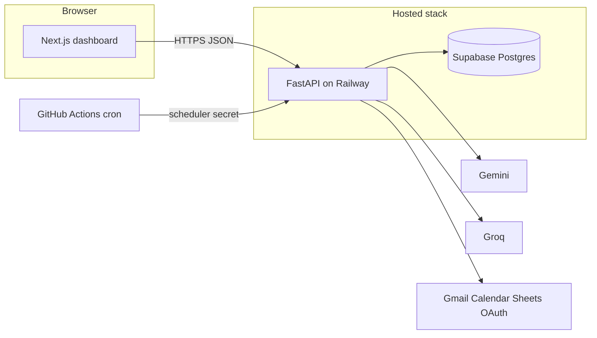

# Groww Product Operations Ecosystem

**Groww Product Operations Ecosystem** is a **single-dashboard product** that combines review intelligence, grounded mutual-fund Q&A, fee explanations, advisor booking with **human approval**, optional **voice** input, and **governed Google actions**—all orchestrated by a **FastAPI** backend that owns business logic and state in **Supabase Postgres**.  
The frontend is **Next.js** (**Customer**, **Product**, **Advisor** tabs). **Phases 1–9 are implemented** in this repository (product behavior through voice + deployment); detailed contracts live in [`Docs/UserFlow.md`](Docs/UserFlow.md), [`Docs/Architecture.md`](Docs/Architecture.md), and [`Docs/Low Level Architecture.md`](Docs/Low%20Level%20Architecture.md).

---

## What this project is actually doing

In plain terms, the app does four connected jobs:

1. **Answer Groww mutual fund and fee questions with sources**  
   The **Customer** tab chat calls the backend, which classifies intent, retrieves from a **RAG index** (BM25 + embeddings + structured fund metrics where applicable), and returns answers that stay **fact-grounded** to an approved corpus (Groww fund pages + fixtures under [`backend/app/rag/`](backend/app/rag/)). **Hybrid** questions (MF + fee in one message) are supposed to be fully addressed. The model **must refuse** investment advice, return predictions, and PII—enforced in product rules and covered by automated checks.

2. **Turn Play Store reviews into a Weekly Pulse for PMs**  
   Scripts collect **Groww** Android reviews (Playwright against the public listing), normalize and store them, and the backend runs **Groq**-assisted theme extraction and **Gemini** synthesis to produce a **weekly pulse** (themes, quotes, action ideas). The **Product** tab shows that pulse; PMs can **subscribe** to email; a **GitHub Actions** cron can trigger the scheduler route on the backend for recurring runs.

3. **Run advisor bookings with human-in-the-loop**  
   Customers **book** from the **Customer** tab and get a **booking ID**. Bookings sit in **pending** until an **Advisor** **approves** (or rejects) in the **Advisor** tab. Only after approval do governed side effects (e.g. confirmation email, calendar) run through **Google OAuth**—no service accounts. Chat context is summarized for the advisor where the UI surfaces it.

4. **Optional voice and external integrations**  
   **Phase 8** adds a **voice** API surface and client wiring so users can speak as well as type in the same thread (exact STT/TTS behavior depends on env and Google voice APIs). **Phase 7** wires **Gmail**, **Calendar**, **Sheets** (export), and the **internal scheduler** route behind secrets.

**Single brand:** everything is **Groww-only**—there is no multi-brand switch. **Google Sheets** is not a source of truth; it is an optional export surface. **Product** tab does **not** host the standalone “fee explainer” widget; that structured experience is for **Customer** / **Advisor** contexts per [`Docs/UserFlow.md`](Docs/UserFlow.md).

---

## How the pieces connect (high level)



- The **browser** never holds workflow truth: badge counts, bookings, pulse rows, and OAuth tokens (server-side) live in the **backend** / **DB**.  
- **`NEXT_PUBLIC_API_BASE_URL`** tells the frontend where the API lives (local or Railway).  
- **CORS** allowlists the **Vercel** (or local) frontend origin via **`FRONTEND_BASE_URL`** on the backend.

---

## Using the dashboard (step-by-step)

The shell loads **health** and **badges** on startup, then you switch tabs at the top. Default tab is **Customer** (`frontend/app/page.tsx`).

### Before you start

- **Local:** backend on **:8000**, frontend on **:3000** (typical).  
- **Production:** open the [dashboard URL](#production-hosted) below; the UI talks to the hosted API.  
- If **chat** returns weak MF answers, ensure the **RAG index** was built (see [RAG index](#rag-index-local--server-file-mode)).

---

### 1) Customer tab — “I’m a customer using support”

| Step | What to do | Why it matters |
| --- | --- | --- |
| A | Read the **status / badges** if shown; wait until the app is not in a hard error state. | Confirms API + Supabase connectivity from the client. |
| B | Use **suggested prompts** or type a question. | Prompts are aligned to supported MF/fee flows and booking shortcuts. |
| C | Ask **MF facts**, **fee / exit load / SIP** style questions, or **both in one message** (hybrid). | Backend routes to RAG + structured metrics and merges citations. |
| D | Use **voice** if enabled: speak, review transcribed text, edit if needed, send. | Voice and text share the same session context in the product design. |
| E | To **book an advisor**, use booking shortcuts or the booking flow in the UI. | Creates a **pending** booking; save the **booking ID** shown in chat—it is **copyable** and required to cancel. |
| F | To **cancel**, run the cancel flow and paste the **same booking ID**. | Backend validates idempotency and safe errors on bad IDs. |
| G | Use **new chat** when you want a fresh thread (if the control is present). | History is per session until reset. |

**Policies (what you should see):** no “buy this fund” advice, no performance guarantees, no fake CEO emails. Those paths are **refused** by design.

---

### 2) Product tab — “I’m a PM watching review-driven themes”

| Step | What to do | Why it matters |
| --- | --- | --- |
| A | Open **Product** and read the **current Weekly Pulse** (themes, quotes, actions). | This is the M2-style intelligence surface. |
| B | Use **subscribe / unsubscribe** for pulse email if shown. | Target cadence: **Mondays 10:00 IST** per product doc; backend stores subscription state. |
| C | If you need a **fresh pulse** in dev, run generation from the UI or `POST /api/v1/pulse/generate` (fixture or real data). | Real pulses need **ingested reviews** in Supabase (see [Pulse pipeline](#pulse-pipeline-optional-local-data-path)). |
| D | Check **analytics / issue** widgets tied to **bookings and chat** where implemented. | Analytics are meant to reflect **in-app** booking/chat context—not Sheets as SoT. |

**Scope note:** this tab is **not** the place for open-ended **fee explainer** demos; that lives on **Customer** / **Advisor** surfaces per [`Docs/UserFlow.md`](Docs/UserFlow.md).

---

### 3) Advisor tab — “I’m approving real bookings”

| Step | What to do | Why it matters |
| --- | --- | --- |
| A | Review **pending** rows: each should show **booking ID** and **conversation / context** summary when wired. | HITL gate before any confirmation email. |
| B | **Approve** only when the slot and context look correct; use **reject** when not. | Triggers or skips governed Gmail/Calendar steps on the backend. |
| C | Check **upcoming** after approvals. | Confirms shared state with the customer journey. |

**Prerequisite in prod/staging:** Google **OAuth** must be completed for the operations account (`GET /api/v1/auth/google/login` on the API host). Redirect URI must be exactly  
`https://loving-art-production-d433.up.railway.app/api/v1/auth/google/callback` (see [Production](#production-hosted)).

---

## Capabilities at a glance

| Area | What ships in this repo |
| --- | --- |
| Customer chat | Intent routing, RAG retrieval, citations, session/history APIs, refusals |
| Voice | Voice routes + UI hookup (full audio quality = operational testing) |
| Pulse | Generate, current, history, subscribe, send-now; Play Store ingest scripts |
| Booking | Create, get, cancel, idempotent submit semantics |
| Advisor | Pending / upcoming / approve / reject |
| Integrations | Gmail, Calendar, Sheets export, scheduler webhook, OAuth token storage |
| Ops | Health + safe settings snapshot, correlation IDs, structured logging |
| Deploy | Docker + Railway backend, Vercel frontend, Supabase SQL, weekly cron workflow |

---

## Documentation map

| Doc | Read this when you… |
| --- | --- |
| [`Docs/UserFlow.md`](Docs/UserFlow.md) | Need the short **product story** per role |
| [`Docs/Architecture.md`](Docs/Architecture.md) | Need **decisions, env model, and system boundaries** |
| [`Docs/Low Level Architecture.md`](Docs/Low%20Level%20Architecture.md) | Need **exact routes and modules** |
| [`Docs/Rules.md`](Docs/Rules.md) | Need **engineering invariants** |
| [`Docs/Failures&EdgeCases.md`](Docs/Failures&EdgeCases.md) | Need **failure behavior** |
| [`Docs/DeploymentGuide.md`](Docs/DeploymentGuide.md) | Need **Supabase → Railway → Vercel → secrets** |
| [`Docs/Runbook.md`](Docs/Runbook.md) | Need **smoke tests, incidents, recovery** |
| [`Deliverables/Resources.md`](Deliverables/Resources.md) | Need **canonical external URLs** |
| [`Docs/Evals.md`](Docs/Evals.md) | Need **eval scores and acceptance narrative** |

**Automated quality gates:** from `backend/`, run `py -3.11 -m app.evals.run_all --all` (phases **1–9**). Threshold **≥ 85%** per phase. Automation **does not** replace a full **Runbook** end-to-end pass for UX and live Google behavior.

---

## Production (hosted)

| Surface | URL |
| --- | --- |
| Dashboard (Vercel) | [groww-product-ops-ecosystem.vercel.app](https://groww-product-ops-ecosystem.vercel.app) |
| API origin (Railway) | [loving-art-production-d433.up.railway.app](https://loving-art-production-d433.up.railway.app) |
| Health | [GET /api/v1/health](https://loving-art-production-d433.up.railway.app/api/v1/health) |
| Google OAuth redirect (`GOOGLE_REDIRECT_URI` + GCP) | `https://loving-art-production-d433.up.railway.app/api/v1/auth/google/callback` |

If OAuth was ever registered as `.../api/v1/auth/callback`, fix it to **`.../api/v1/auth/google/callback`** (matches [`backend/app/api/v1/auth.py`](backend/app/api/v1/auth.py)).

---

## Tech stack

- **Frontend:** Next.js, TypeScript, Tailwind, shadcn-style components — [`frontend/`](frontend/)  
- **Backend:** FastAPI, Python **3.11** — [`backend/`](backend/)  
- **Database:** Supabase Postgres — SQL under [`infra/supabase/`](infra/supabase/)  
- **LLMs:** **Gemini** (synthesis), **Groq** (token-heavy preprocessing), each with **primary + fallback** keys in production configs  
- **Deploy:** root [`Dockerfile`](Dockerfile) + [`railway.toml`](railway.toml); [`vercel.json`](vercel.json); scheduler [`.github/workflows/weekly-pulse.yml`](.github/workflows/weekly-pulse.yml)

---

## RAG index (local / server file mode)

Full retrieval quality depends on on-disk artefacts: `backend/app/rag/index/chunks.json` and `mf_metrics.json`. **Run once per clone** (or after changing corpus inputs):

```powershell
# Repository root
backend\.venv\Scripts\python.exe scripts\rebuild_index.py
```

- Add **`--scrape`** to refresh from live Groww pages (needs Chromium: `playwright install chromium` from `backend/`).  
- **`SKIP_PLAYWRIGHT_MF=true`** skips browser enrichment during scrape when you need a faster run.

---

## Local development (quick path)

**Prerequisites:** Node 18+ (for Next.js), Python **3.11**, a Supabase project (or explicit skip flag for experiments only).

1. **Environment** — Copy [`.env.example`](.env.example) → `.env` at repo root and fill backend variables (`FRONTEND_BASE_URL`, `SUPABASE_URL`, `SUPABASE_SERVICE_ROLE_KEY`, LLM keys as needed). Use `PHASE1_SKIP_SUPABASE_STARTUP_CHECK=true` **only** if you intentionally run without Supabase.  
2. **Schema** — Run [`infra/supabase/phase1_phase2_schema.sql`](infra/supabase/phase1_phase2_schema.sql) in the Supabase SQL editor.  
3. **Backend**

   ```powershell
   cd backend
   py -3.11 -m venv .venv
   .\.venv\Scripts\python.exe -m pip install -r requirements.txt
   .\.venv\Scripts\python.exe -m uvicorn app.main:app --reload --port 8000
   ```

4. **Frontend** — Set `NEXT_PUBLIC_API_BASE_URL=http://127.0.0.1:8000` in `frontend/.env.local` **or** your shell.

   ```powershell
   cd ..\frontend
   npm install
   npm run dev
   ```

5. **Smoke** — Open [http://localhost:3000](http://localhost:3000); run `Invoke-RestMethod http://127.0.0.1:8000/api/v1/health`.

Windows helper: [`backend/ensure_python_env.ps1`](backend/ensure_python_env.ps1). Editor default interpreter: [`.vscode/settings.json`](.vscode/settings.json) points at `backend/.venv` on Windows.

---

## Pulse pipeline (optional — real review data)

Use this when you want **non-fixture** pulses locally:

```powershell
cd backend
.\.venv\Scripts\python.exe -m playwright install chromium
cd ..
backend\.venv\Scripts\python.exe scripts\fetch_groww_playstore_reviews.py --limit 200 --out reviews_raw.json
backend\.venv\Scripts\python.exe scripts\ingest_sources.py --in reviews_raw.json
Invoke-RestMethod -Method Post -Uri http://127.0.0.1:8000/api/v1/pulse/generate -ContentType application/json -Body '{"use_fixture":false,"lookback_weeks":8}'
Invoke-RestMethod http://127.0.0.1:8000/api/v1/pulse/current
```

Full ordering and failure handling: [`Docs/Runbook.md`](Docs/Runbook.md).

---

## Evals

```powershell
cd backend
.\.venv\Scripts\python.exe -m app.evals.run_all --phase 1
# Full automated suite:
.\.venv\Scripts\python.exe -m app.evals.run_all --all
```

Human-readable report: [`Docs/Evals.md`](Docs/Evals.md).

---

## Key folders

| Path | Contents |
| --- | --- |
| [`frontend/app`](frontend/app) | Next.js app router entry |
| [`frontend/components`](frontend/components) | Customer / Product / Advisor / shared UI |
| [`backend/app/api/v1`](backend/app/api/v1) | HTTP routers (health, chat, pulse, booking, advisor, auth, voice, …) |
| [`backend/app/services`](backend/app/services) | Workflows, LLM composition, integrations |
| [`backend/app/evals`](backend/app/evals) | Phase 1–9 automated checks |
| [`scripts/`](scripts) | Play Store fetch, ingest, index rebuild |
